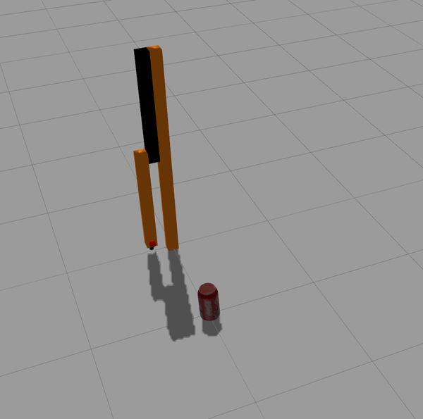
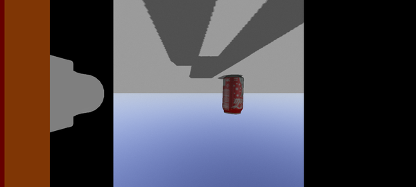
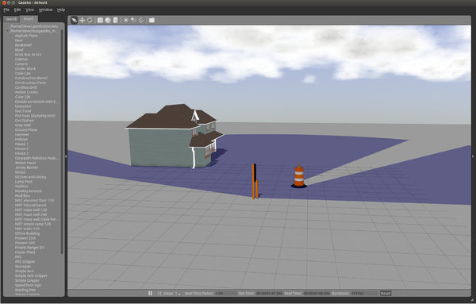
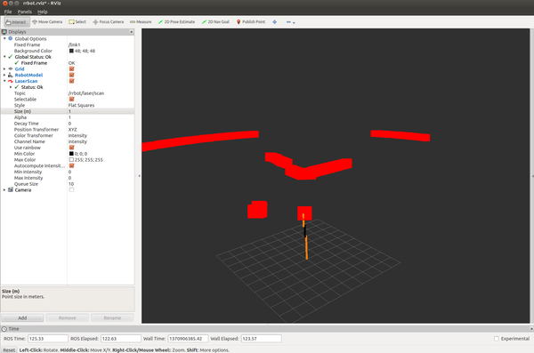

## Gazebo plugins in ROS
## 教程: 使用ROS的Gazebo插件

Gazebo插件为你的URDF模型提供了更强大的功能，并且可以绑定ROS消息和服务调用，用于传感器输出和电机输入。在本教程中，我们既解释了如何设置预先存在的插件，也解释了如何创建你自己的自定义插件，可以与ROS一起工作

#### 预备知识

确保你已经按照之前URDFs教程中描述的RRBot设置。另外，请确保你已经理解了URDF描述中`<gazebo>`元素的使用，这也是同一个教程中的内容

#### 插件类型

Gazebo支持[多种插件类型](http://gazebosim.org/tutorials?tut=plugins_hello_world&cat=write_plugin)，所有的插件都可以连接到ROS，但只有少数类型可以通过URDF文件引用

1. [ModelPlugins](http://osrf-distributions.s3.amazonaws.com/gazebo/api/dev/classgazebo_1_1ModelPlugin.html)，提供对[physics::Model](http://osrf-distributions.s3.amazonaws.com/gazebo/api/dev/classgazebo_1_1physics_1_1Model.html)API的访问
2. [SensorPlugins](http://osrf-distributions.s3.amazonaws.com/gazebo/api/dev/classgazebo_1_1SensorPlugin.html)，提供对[sensors::Sensor](http://osrf-distributions.s3.amazonaws.com/gazebo/api/dev/classgazebo_1_1sensors_1_1Sensor.html)API的访问
3. [VisualPlugins](http://osrf-distributions.s3.amazonaws.com/gazebo/api/dev/classgazebo_1_1VisualPlugin.html)，提供对[rendering::Visual](http://osrf-distributions.s3.amazonaws.com/gazebo/api/dev/classgazebo_1_1rendering_1_1Visual.html)API的访问

#### 添加 `ModelPlugin`

简而言之，`ModelPlugin`被插入到URDF中的`<robot>`元素内。它用`<gazebo>`包装，以表示传递给Gazebo的信息。例如：

```xml
<robot>
  ... robot description ...
  <gazebo>
    <plugin name="differential_drive_controller" filename="libdiffdrive_plugin.so">
      ... plugin parameters ...
    </plugin>
  </gazebo>
  ... robot description ...
</robot>
```

在Gazebo中加载[robot model](http://osrf-distributions.s3.amazonaws.com/gazebo/api/dev/classgazebo_1_1physics_1_1Model.html)时，`diffdrive_plugin`代码将被赋予模型本身的引用，允许它对其进行操作。同时，它也会给自己的[SDF元素](http://osrf-distributions.s3.amazonaws.com/sdformat/api/dev/classsdf_1_1Element.html)一个引用，以便读取传递给它的插件参数

#### 添加 `SensorPlugin`

指定传感器插件略有不同。Gazebo中的[Sensors](http://gazebosim.org/api/dev/group__gazebo__sensors.html)意在连接到link，所以描述该传感器的`<gazebo>`元素必须给该链接一个引用。例如：`<gazebo>`元素

```xml
<robot>
  ... robot description ...
  <link name="sensor_link">
    ... link description ...
  </link>

  <gazebo reference="sensor_link">
    <sensor type="camera" name="camera1">
      ... sensor parameters ...
      <plugin name="camera_controller" filename="libgazebo_ros_camera.so">
        ... plugin parameters ..
      </plugin>
    </sensor>
  </gazebo>

</robot>
```

在Gazebo中加载机器人模型时，`Camera_controller`代码将被赋予一个对传感器的引用，提供对其API的访问。同时，它也会给自己一个SDF元素的引用，以便读取传递给它的插件参数

# 在`gazebo_plugins`中可用的插件

下面的章节记录了 `gazebo_plugins`中所有可用的插件，我们建议你按顺序查看它们，因为前几个插件中涵盖了更多的细节，你可以从各种插件的文档中学习一些概念。

每个部分的名称都来自于插件类名。例如，"Block Laser"来自`GazeboRosBlockLaser`类，可以在文件`gazebo_plugins/src/gazebo_ros_block_laser.cpp`中找到

如果有一些部分是空白的，说明这个作者厌倦了记录每一个插件，你应该用你的经验来填补这个区域，如果你有知识和例子如何使用特定的插件

#### 相机

**说明：**提供ROS接口，通过发布`sensor_msgs`中描述的CameraInfo和Image ROS消息来模拟`wge100_camera`等相机

##### RRBot 例子

在本节中，我们将回顾一个连接到RRBot摆臂末端的简单RGB摄像头。你可以看`rrbot.xacro`里面的解释。这个块的第一个元素是一个额外的链接和关节添加到URDF文件中，表示相机。我们只是用一个简单的红框来表示摄像机，不过通常你可以使用一个网格文件来更好的表示

```xml
  <joint name="camera_joint" type="fixed">
    <axis xyz="0 1 0" />
    <origin xyz="${camera_link} 0 ${height3 - axel_offset*2}" rpy="0 0 0"/>
    <parent link="link3"/>
    <child link="camera_link"/>
  </joint>

  <!-- Camera -->
  <link name="camera_link">
    <collision>
      <origin xyz="0 0 0" rpy="0 0 0"/>
      <geometry>
    <box size="${camera_link} ${camera_link} ${camera_link}"/>
      </geometry>
    </collision>

    <visual>
      <origin xyz="0 0 0" rpy="0 0 0"/>
      <geometry>
    <box size="${camera_link} ${camera_link} ${camera_link}"/>
      </geometry>
      <material name="red"/>
    </visual>

    <inertial>
      <mass value="1e-5" />
      <origin xyz="0 0 0" rpy="0 0 0"/>
      <inertia ixx="1e-6" ixy="0" ixz="0" iyy="1e-6" iyz="0" izz="1e-6" />
    </inertial>
  </link>
```

还定义了一个Xacro属性

```xml
  <xacro:property name="camera_link" value="0.05" /> <!-- Size of square 'camera' box -->
```

你应该可以启动RRBot，并看到一个连接到手臂末端的红色盒子

接下来我们将回顾一下Gazebo插件，它为我们提供了相机功能，并将图像发布到ROS消息中。在RRBot中，我们一直遵循着将Gazebo元素放在`rbot.gazebo`文件中的惯例

```xml
  <!-- camera -->
  <gazebo reference="camera_link">
    <sensor type="camera" name="camera1">
      <update_rate>30.0</update_rate>
      <camera name="head">
        <horizontal_fov>1.3962634</horizontal_fov>
        <image>
          <width>800</width>
          <height>800</height>
          <format>R8G8B8</format>
        </image>
        <clip>
          <near>0.02</near>
          <far>300</far>
        </clip>
        <noise>
          <type>gaussian</type>
          <!-- Noise is sampled independently per pixel on each frame.
               That pixel's noise value is added to each of its color
               channels, which at that point lie in the range [0,1]. -->
          <mean>0.0</mean>
          <stddev>0.007</stddev>
        </noise>
      </camera>
      <plugin name="camera_controller" filename="libgazebo_ros_camera.so">
        <alwaysOn>true</alwaysOn>
        <updateRate>0.0</updateRate>
        <cameraName>rrbot/camera1</cameraName>
        <imageTopicName>image_raw</imageTopicName>
        <cameraInfoTopicName>camera_info</cameraInfoTopicName>
        <frameName>camera_link</frameName>
        <hackBaseline>0.07</hackBaseline>
        <distortionK1>0.0</distortionK1>
        <distortionK2>0.0</distortionK2>
        <distortionK3>0.0</distortionK3>
        <distortionT1>0.0</distortionT1>
        <distortionT2>0.0</distortionT2>
      </plugin>
    </sensor>
  </gazebo>
```

让我们来讨论一下这个插件的一些特性...

```xml
  <gazebo reference="camera_link">
```

链接名称`camera_link`必须与我们添加到Xacro URDF中的链接名称一致

```xml
    <sensor type="camera" name="camera1">
```

传感器名称"camera1"必须与所有其他传感器名称唯一。除了在Gazebo插件内，这个名字在很多地方都没有被使用，你可以访问

```xml
      <update_rate>30.0</update_rate>
```

每秒钟在Gazebo内拍摄新相机图像的次数。这是传感器在模拟过程中尝试的最大更新速率，但如果物理模拟运行的速度比传感器生成的速度快，它可能会落后于这个目标速率

```xml
        <horizontal_fov>1.3962634</horizontal_fov>
        <image>
          <width>800</width>
          <height>800</height>
          <format>R8G8B8</format>
        </image>
        <clip>
          <near>0.02</near>
          <far>300</far>
        </clip>
```

填写这些值，以符合制造商对你的物理相机硬件的规格。需要注意的是，像素被假定为方形

此外，近距离和远距离剪辑是特定于模拟的参数，给出了相机在模拟中可以看到物体的距离的上限和下限。这是在摄像机的验光框架中指定的

```xml
      <plugin name="camera_controller" filename="libgazebo_ros_camera.so">
```

这是实际的`gazebo_ros/gazebo_ros_camera.cpp`文件作为一个共享对象被链接到的地方

```xml
        <cameraName>rrbot/camera1</cameraName>
        <imageTopicName>image_raw</imageTopicName>
        <cameraInfoTopicName>camera_info</cameraInfoTopicName>
```

在这里，我们定义了摄像机要发布到的 rostopic，用于图像话题和摄像机信息话题。对于 RRBot，您应该订阅

```sh
/rrbot/camera1/image_raw
/rrbot/camera1/camera_info
```
```xml
        <frameName>camera_link</frameName>
```

图像在tf树中发布的坐标框

##### 运行RRBot示例

当你保存了`rbot.xacro`和`rbot.gazebo`之后，你应该可以在不同的终端中同时启动Rviz和Gazebo

```sh
roslaunch rrbot_gazebo rrbot_world.launch
roslaunch rrbot_description rrbot_rviz.launch
```

在Rviz中，添加一个Camera显示，并在Image Topic下将其设置为`/rrbot/camera1/image_raw`

你应该看到你的Gazebo环境的相机视图。在下面的两张图片中，为了更好的视觉效果，在环境中添加了一个汽水罐

可乐罐加之后：




摆锤落下后，对应的相机视角



#### 多功能摄像机

**说明：** 同步多个摄像机的快门，使它们一起发布图像。通常用于立体相机，使用与`Camera`插件非常相似的界面

**注意：** 现在只支持立体相机，参见[Github issue](https://github.com/osrf/gazebo_ros_pkgs/issues/13)

##### Atlas代码示例

在这个代码示例中，同时有左、右摄像机

```xml
  <gazebo reference="left_camera_frame">
    <sensor type="multicamera" name="stereo_camera">
      <update_rate>30.0</update_rate>
      <camera name="left">
        <horizontal_fov>1.3962634</horizontal_fov>
        <image>
          <width>800</width>
          <height>800</height>
          <format>R8G8B8</format>
        </image>
        <clip>
          <near>0.02</near>
          <far>300</far>
        </clip>
        <noise>
          <type>gaussian</type>
          <mean>0.0</mean>
          <stddev>0.007</stddev>
        </noise>
      </camera>
      <camera name="right">
        <pose>0 -0.07 0 0 0 0</pose>
        <horizontal_fov>1.3962634</horizontal_fov>
        <image>
          <width>800</width>
          <height>800</height>
          <format>R8G8B8</format>
        </image>
        <clip>
          <near>0.02</near>
          <far>300</far>
        </clip>
        <noise>
          <type>gaussian</type>
          <mean>0.0</mean>
          <stddev>0.007</stddev>
        </noise>
      </camera>
      <plugin name="stereo_camera_controller" filename="libgazebo_ros_multicamera.so">
        <alwaysOn>true</alwaysOn>
        <updateRate>0.0</updateRate>
        <cameraName>multisense_sl/camera</cameraName>
        <imageTopicName>image_raw</imageTopicName>
        <cameraInfoTopicName>camera_info</cameraInfoTopicName>
        <frameName>left_camera_optical_frame</frameName>
        <!--<rightFrameName>right_camera_optical_frame</rightFrameName>-->
        <hackBaseline>0.07</hackBaseline>
        <distortionK1>0.0</distortionK1>
        <distortionK2>0.0</distortionK2>
        <distortionK3>0.0</distortionK3>
        <distortionT1>0.0</distortionT1>
        <distortionT2>0.0</distortionT2>
      </plugin>
    </sensor>
  </gazebo>
```

##### 深度相机

**说明：** 模拟一个类似Kinect的传感器，在Kinect插件中复制。将来可能会被合并

#### Openni Kinect

说明：模拟微软Kinect，发布与这里Fuerte文档中记载的微软kinect对应的ROS驱动相同的主题

```sh
<gazebo reference="${link_name}">
  <sensor name="${link_name}_camera" type="depth">
    <update_rate>20</update_rate>
    <camera>
      <horizontal_fov>1.047198</horizontal_fov>
      <image>
        <width>640</width>
        <height>480</height>
        <format>R8G8B8</format>
      </image>
      <clip>
        <near>0.05</near>
        <far>3</far>
      </clip>
    </camera>
    <plugin name="${link_name}_controller" filename="libgazebo_ros_openni_kinect.so">
      <baseline>0.2</baseline>
      <alwaysOn>true</alwaysOn>
      <updateRate>1.0</updateRate>
      <cameraName>${camera_name}_ir</cameraName>
      <imageTopicName>/${camera_name}/color/image_raw</imageTopicName>
      <cameraInfoTopicName>/${camera_name}/color/camera_info</cameraInfoTopicName>
      <depthImageTopicName>/${camera_name}/depth/image_raw</depthImageTopicName>
      <depthImageInfoTopicName>/${camera_name}/depth/camera_info</depthImageInfoTopicName>
      <pointCloudTopicName>/${camera_name}/depth/points</pointCloudTopicName>
      <frameName>${frame_name}</frameName>
      <pointCloudCutoff>0.5</pointCloudCutoff>
      <pointCloudCutoffMax>3.0</pointCloudCutoffMax>
      <distortionK1>0.00000001</distortionK1>
      <distortionK2>0.00000001</distortionK2>
      <distortionK3>0.00000001</distortionK3>
      <distortionT1>0.00000001</distortionT1>
      <distortionT2>0.00000001</distortionT2>
      <CxPrime>0</CxPrime>
      <Cx>0</Cx>
      <Cy>0</Cy>
      <focalLength>0</focalLength>
      <hackBaseline>0</hackBaseline>
    </plugin>
  </sensor>
</gazebo>
```

你可以在[Use a Gazebo Depth Camera with ROS](./ROS%20Depth%20Camera%20Integration.md)中找到关于配置深度相机的更详细描述

#### GPU Laser

**说明**： 模拟激光测距传感器，按照`sensor_msgs`中描述的方式播放激光扫描信息。参见[Hokuyo Laser Scanners Reference](http://ros.org/wiki/hokuyo_node)

##### RRBot 例子

在回顾本例之前，请参见RRBot示例，了解如何向RRBot添加摄像头。与添加相机类似，我们将为RRBot的Xacro URDF添加一个新的链接和关节。这一次，我们将不只使用一个矩形作为视觉模型，而是使用一个网格

```xml
  <joint name="hokuyo_joint" type="fixed">
    <axis xyz="0 1 0" />
    <origin xyz="0 0 ${height3 - axel_offset/2}" rpy="0 0 0"/>
    <parent link="link3"/>
    <child link="hokuyo_link"/>
  </joint>

  <!-- Hokuyo Laser -->
  <link name="hokuyo_link">
    <collision>
      <origin xyz="0 0 0" rpy="0 0 0"/>
      <geometry>
    <box size="0.1 0.1 0.1"/>
      </geometry>
    </collision>

    <visual>
      <origin xyz="0 0 0" rpy="0 0 0"/>
      <geometry>
        <mesh filename="package://rrbot_description/meshes/hokuyo.dae"/>
      </geometry>
    </visual>

    <inertial>
      <mass value="1e-5" />
      <origin xyz="0 0 0" rpy="0 0 0"/>
      <inertia ixx="1e-6" ixy="0" ixz="0" iyy="1e-6" iyz="0" izz="1e-6" />
    </inertial>
  </link>
```

现在，我们将把插件信息添加到`rrbot.gazebo`中，同样和相机的例子一样

```xml
  <!-- hokuyo -->
  <gazebo reference="hokuyo_link">
    <sensor type="gpu_ray" name="head_hokuyo_sensor">
      <pose>0 0 0 0 0 0</pose>
      <visualize>false</visualize>
      <update_rate>40</update_rate>
      <ray>
        <scan>
          <horizontal>
            <samples>720</samples>
            <resolution>1</resolution>
            <min_angle>-1.570796</min_angle>
            <max_angle>1.570796</max_angle>
          </horizontal>
        </scan>
        <range>
          <min>0.10</min>
          <max>30.0</max>
          <resolution>0.01</resolution>
        </range>
        <noise>
          <type>gaussian</type>
          <!-- Noise parameters based on published spec for Hokuyo laser
               achieving "+-30mm" accuracy at range < 10m.  A mean of 0.0m and
               stddev of 0.01m will put 99.7% of samples within 0.03m of the true
               reading. -->
          <mean>0.0</mean>
          <stddev>0.01</stddev>
        </noise>
      </ray>
      <plugin name="gazebo_ros_head_hokuyo_controller" filename="libgazebo_ros_gpu_laser.so">
        <topicName>/rrbot/laser/scan</topicName>
        <frameName>hokuyo_link</frameName>
      </plugin>
    </sensor>
  </gazebo>
```

大多数属性是不言而喻的，但我们将在下面回顾一些属性

```xml
     <visualize>false</visualize>
```

如果是真的，在gpu激光器的扫描区域内会出现半透明的激光射线。这可能是一种信息可视化，也可能是一种干扰

关于`<sensor>`和`<ray>`元素的更多文档可以在[SDF Documention](http://gazebosim.org/sdf/dev.html#sensor225)中找到

```xml
<topicName>/rrbot/laser/scan</topicName>
<frameName>hokuyo_link</frameName>
```

将这些设置为你想要发布激光扫描的ROS主题名称，以及你想要TF使用的变换框架

##### 运行RRBot示例

当你保存了`rbot.xacro`和`rbot.gazebo`之后，你应该可以在不同的终端中同时启动Rviz和Gazebo

```sh
roslaunch rrbot_gazebo rrbot.launch
roslaunch rrbot_description rrbot_rviz.launch
```

在Rviz中，添加一个 LaserScan 显示，并在 Topic 下将其设置为`/rrbot/laser/scan`

你应该在你的Gazebo环境中看到一条微弱的激光扫描线。当钟摆摆动的时候，你也应该看到激光扫描线在摆动。如果扫描线太微弱，你可以在Rviz的LaserScan显示的属性中调高激光扫描线的大小，1m的大小是非常容易看到的。在下面的两张图中，为了更好的视觉效果，在环境中加入了房子和建筑桶

在Gazebo中查看



从Rviz的相应激光视图



#### 激光

**说明**：`GPU Laser`的非GPU版本，但基本上使用相同的代码。参见GPU Laser的文档

要使用RRBot运行，打开`rrbot.gazebo`并修改以下两行

替换

```xml
    <sensor type="gpu_ray" name="head_hokuyo_sensor">
```

用

```xml
    <sensor type="ray" name="head_hokuyo_sensor">
```

并替换

```xml
      <plugin name="gazebo_ros_head_hokuyo_controller" filename="libgazebo_ros_gpu_laser.so">
```

用

```xml
      <plugin name="gazebo_ros_head_hokuyo_controller" filename="libgazebo_ros_laser.so">
```

保存，然后启动与GPU Laser相同的启动文件

#### 激光块

**说明**：提供网格式激光测距仪模拟（如 Velodyne）

#### F3D(力反馈地面真值)

**说明**：在模拟中通过WrenchStamped消息广播外力，如`geometry_msgs`中所述

#### 力

**说明**: ROS接口，用于在模拟中对主体应用Wrench (`geometry_msgs`)

#### IMU (GazeboRosImu)

**说明**：模拟IMU传感器。测量结果由ROS插件计算，而不是由Gazebo计算。请看下面的使用片段示例来实现

```xml
<robot>
:
  <gazebo>
    <plugin name="imu_plugin" filename="libgazebo_ros_imu.so">
      <alwaysOn>true</alwaysOn>
      <bodyName>base_footprint</bodyName>
      <topicName>imu</topicName>
      <serviceName>imu_service</serviceName>
      <gaussianNoise>0.0</gaussianNoise>
      <updateRate>20.0</updateRate>
    </plugin>
  </gazebo>
</robot>
```

#### IMU sensor (GazeboRosImuSensor)

**说明**：模拟一个惯性运动单元传感器，与**IMU**(GazeboRosIMU)的主要区别是：继承自SensorPlugin而不是ModelPlugin, - 测量值由Gazebo ImuSensor提供而不是由ros插件计算, - 惯性测量中包含重力. - 将`initialOrientationAsReference`设置为`false`，以符合[REP 145](https://www.ros.org/reps/rep-0145.html)的要求

```xml
  <gazebo reference="imu_link">
    <gravity>true</gravity>
    <sensor name="imu_sensor" type="imu">
      <always_on>true</always_on>
      <update_rate>100</update_rate>
      <visualize>true</visualize>
      <topic>__default_topic__</topic>
      <plugin filename="libgazebo_ros_imu_sensor.so" name="imu_plugin">
        <topicName>imu</topicName>
        <bodyName>imu_link</bodyName>
        <updateRateHZ>10.0</updateRateHZ>
        <gaussianNoise>0.0</gaussianNoise>
        <xyzOffset>0 0 0</xyzOffset>
        <rpyOffset>0 0 0</rpyOffset>
        <frameName>imu_link</frameName>
        <initialOrientationAsReference>false</initialOrientationAsReference>
      </plugin>
      <pose>0 0 0 0 0 0</pose>
    </sensor>
  </gazebo>
```

#### 联合姿势轨迹

**说明**：监听一个`jointtrajectory`动作并回放一组关节位置。在不考虑模拟物理和力的情况下，将关节集设置为精确位置

#### P3D(地面实况三维定位接口)

**说明**：在模拟中通过Odometry消息广播任何物体的惯性姿势，如通过ROS主题的`nav_msgs`所述

#### Projector

**说明**：从源头向外投射静态纹理，如PR2的原始头部摄像头传感器使用的纹理。更多信息请参见[API文档](http://osrf-distributions.s3.amazonaws.com/gazebo/api/dev/classgazebo_1_1rendering_1_1Projector.html)

#### Prosilica Camera

**说明**：模拟[ROS Prosilica Camera](http://www.ros.org/wiki/prosilica_camera)所暴露的接口。这里有一个[URDF Xacro的例子](https://bitbucket.org/hsu/nasa_r2_simulator/src/5ee1de067038749dcc133ed7cf87b45715cc4457/r2_gazebo/urdf/sensors/grasshopper2.gazebo.xacro?at=hsu)

#### Bumper

**说明**：通过[ContactsState消息](http://docs.ros.org/api/gazebo_msgs/html/msg/ContactsState.html)提供联系人反馈

```xml
<gazebo>
  <plugin name="${name}_gazebo_ros_bumper_controller" filename="libgazebo_ros_bumper.so">
    <alwaysOn>true</alwaysOn>
    <updateRate>${update_rate}</updateRate>
    <bumperTopicName>${name}_bumper</bumperTopicName>
    <frameName>world</frameName>
  </plugin>
</gazebo>
```

#### 差速器驱动

**说明**：模型插件，为Gazebo中的差速驱动机器人提供了一个基本控制器。你需要一个定义好的差速驱动机器人来使用这个插件

```xml
<gazebo>
  <plugin name="differential_drive_controller" filename="libgazebo_ros_diff_drive.so">

    <!-- Plugin update rate in Hz -->
    <updateRate>${update_rate}</updateRate>

    <!-- Name of left joint, defaults to `left_joint` -->
    <leftJoint>base_link_left_wheel_joint</leftJoint>

    <!-- Name of right joint, defaults to `right_joint` -->
    <rightJoint>base_link_right_wheel_joint</rightJoint>

    <!-- The distance from the center of one wheel to the other, in meters, defaults to 0.34 m -->
    <wheelSeparation>0.5380</wheelSeparation>

    <!-- Diameter of the wheels, in meters, defaults to 0.15 m -->
    <wheelDiameter>0.2410</wheelDiameter>

    <!-- Wheel acceleration, in rad/s^2, defaults to 0.0 rad/s^2 -->
    <wheelAcceleration>1.0</wheelAcceleration>

    <!-- Maximum torque which the wheels can produce, in Nm, defaults to 5 Nm -->
    <wheelTorque>20</wheelTorque>

    <!-- Topic to receive geometry_msgs/Twist message commands, defaults to `cmd_vel` -->
    <commandTopic>cmd_vel</commandTopic>

    <!-- Topic to publish nav_msgs/Odometry messages, defaults to `odom` -->
    <odometryTopic>odom</odometryTopic>

    <!-- Odometry frame, defaults to `odom` -->
    <odometryFrame>odom</odometryFrame>

    <!-- Robot frame to calculate odometry from, defaults to `base_footprint` -->
    <robotBaseFrame>base_footprint</robotBaseFrame>

    <!-- Odometry source, 0 for ENCODER, 1 for WORLD, defaults to WORLD -->
    <odometrySource>1</odometrySource>

    <!-- Set to true to publish transforms for the wheel links, defaults to false -->
    <publishWheelTF>true</publishWheelTF>

    <!-- Set to true to publish transforms for the odometry, defaults to true -->
    <publishOdom>true</publishOdom>

    <!-- Set to true to publish sensor_msgs/JointState on /joint_states for the wheel joints, defaults to false -->
    <publishWheelJointState>true</publishWheelJointState>

    <!-- Set to true to swap right and left wheels, defaults to true -->
    <legacyMode>false</legacyMode>
  </plugin>
</gazebo>
```

#### 防滑转向驱动装置

**描述**：模型插件，为Gazebo中的滑行驱动机器人提供了一个基本的控制器（比如 Pioneer 3AT）

```xml
<gazebo>
  <plugin name="skid_steer_drive_controller" filename="libgazebo_ros_skid_steer_drive.so">
    <updateRate>100.0</updateRate>
    <robotNamespace>/</robotNamespace>
    <leftFrontJoint>front_left_wheel_joint</leftFrontJoint>
    <rightFrontJoint>front_right_wheel_joint</rightFrontJoint>
    <leftRearJoint>back_left_wheel_joint</leftRearJoint>
    <rightRearJoint>back_right_wheel_joint</rightRearJoint>
    <wheelSeparation>0.4</wheelSeparation>
    <wheelDiameter>0.215</wheelDiameter>
    <robotBaseFrame>base_link</robotBaseFrame>
    <torque>20</torque>
    <topicName>cmd_vel</topicName>
    <broadcastTF>false</broadcastTF>
  </plugin>
</gazebo>
```

#### Video Plugin

**描述**：可视化插件，可以在Gazebo内的OGRE纹理上显示ROS图像流。这个插件不会修改现有的一个链接面的纹理，而是在它上面创建一个新的纹理。该纹理将在XY平面上创建，从+Z面可见。该插件在构建纹理时需要一个像素大小，如果传入的ROS图像信息大小不同，则会调整其大小以匹配

```xml
<gazebo reference="display_screen_link">
  <visual>
    <plugin name="display_video_controller" filename="libgazebo_ros_video.so">
      <topicName>image</topicName>
      <height>120</height>
      <width>160</width>
    </plugin>
  </visual>
</gazebo>
```

#### 平面移动插件

**描述**：模型插件，允许任意对象（例如立方体、球体和圆柱体）使用`geometry_msgs/Twist`消息沿水平面移动。该插件的工作原理是每隔一个周期给对象传授一个线性速度(XY)和一个角速度(Z)

这里是一个完整的URDF例子，它演示了如何使用这个插件，使用不同的视觉和碰撞元素来控制Gazebo内的浮动盒子。注意：对象需要有足够的惯性来防止不理想的运动--这可能会作为对提供的速度的反应而发生。你可以尝试增加惯性，直到对象按要求移动。让质量中心靠近地面也是不错的选择

```xml
<robot name="test_model">

  <!-- root link, on the ground just below the model origin -->
  <link name="base_footprint">
   <visual>
      <origin xyz="0 0 0" rpy="0 0 0" />
      <geometry>
        <box size="0.001 0.001 0.001" />
      </geometry>
    </visual>
  </link>

  <joint name="base_link_joint" type="fixed">
    <origin xyz="0.0 0 1.25" rpy="0 0 0" />
    <parent link="base_footprint"/>
    <child link="base_link" />
  </joint>

  <!-- the model -->
  <link name="base_link">
    <inertial>
      <mass value="50" />
      <origin xyz="0 0 -1.25" />
      <inertia ixx="50.0" ixy="0.0" ixz="0.0"
        iyy="50.0" iyz="0.0"
        izz="50.0" />
    </inertial>
    <visual>
      <geometry>
        <box size="0.5 0.5 1.0" /> <!-- does not need to match collision -->
      </geometry>
    </visual>
    <collision>
      <origin xyz="0 0 -1.0" />
      <geometry>
        <cylinder length="0.5" radius="0.25" />
      </geometry>
    </collision>
  </link>

  <gazebo>
    <plugin name="object_controller" filename="libgazebo_ros_planar_move.so">
      <commandTopic>cmd_vel</commandTopic>
      <odometryTopic>odom</odometryTopic>
      <odometryFrame>odom</odometryFrame>
      <odometryRate>20.0</odometryRate>
      <robotBaseFrame>base_footprint</robotBaseFrame>
    </plugin>
  </gazebo>

</robot>
```

#### 模板

**描述**：一个c++插件模板示例，适用于任何想写自己的插件的人

# 议题报告，贡献

Gazebo-ROS插件存储在一个ROS包中。参见[gazebo_plugins wiki](http://wiki.ros.org/gazebo_plugins)页面，了解你如何贡献。

# 3rd party plugins

除了上面解释的插件，还有一些第三方Gazebo-ROS插件。其中一些可以在ros.org上找到（[搜索关键词的例子](https://www.google.com/search?client=ubuntu&channel=fs&q=site%3Aros.org+*_gazebo_plugins&ie=utf-8&oe=utf-8)）。如果一个第三方插件足够有用和通用，请考虑通过在每个版本库的issue tracker打开建议，将其拉到官方的[gazebo_plugins包中（维基页面）](http://wiki.ros.org/gazebo_plugins)

