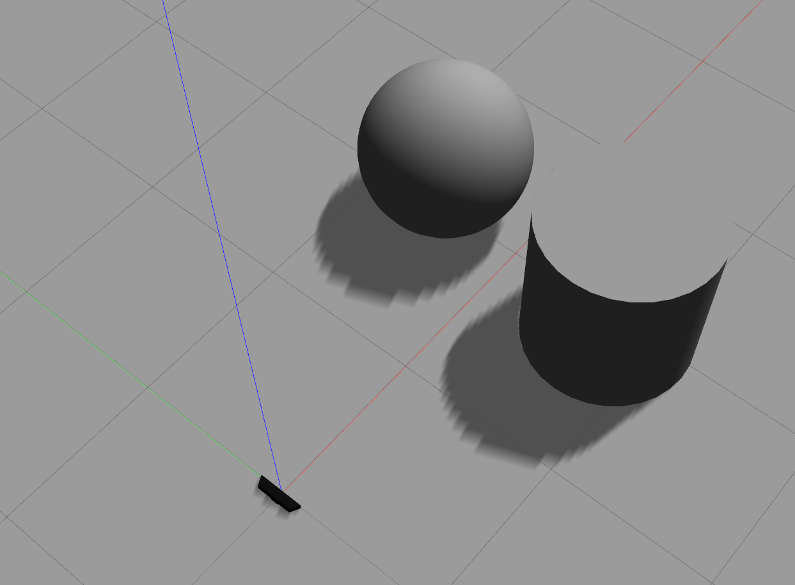
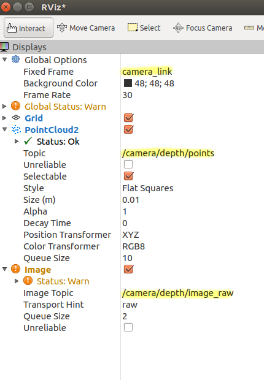
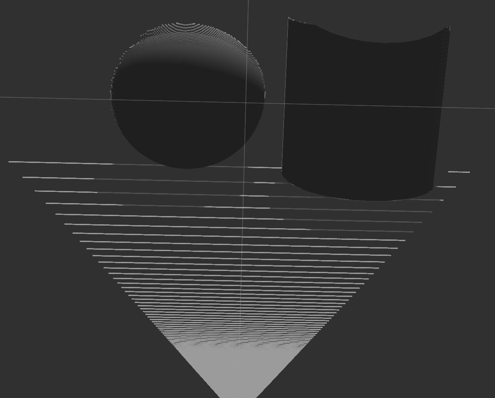

## ROS深度相机集成
## ROS 使用 Gazebo 的深度相机

#### 介绍

在本教程中，你将学习如何将 Gazebo 深度相机连接到 ROS。本教程包括3个主要步骤：

1. 创建一个包含ROS深度相机插件的Gazebo模型
2. 在Gazebo中设置深度摄像头
3. 在RViz中查看深度摄像头的输出

这是一个独立的教程，它没有使用其他Gazebo ROS教程中开发的RRBot。它旨在帮助你在ROS和Gazebo中使用计算机视觉快速上手和运行。

##### 预备知识

在做本教程之前，你应该安装[gazebo_ros_pkgs](./Installing%20gazebo_ros_pkgs(ROS%201).md)

#### 使用深度摄像头插件创建 Gazebo 模型

由于Gazebo和ROS是相互不依赖的独立项目，来自`gazebo_models`资源库的传感器（如深度相机）默认不包含ROS插件。这意味着你必须根据Gazebo模型库中的相机制作一个自定义相机，然后添加自己的`<plugin>`标签，使深度相机的数据发布点云和图像到ROS话题

你应该从Gazebo中可用的相机中选择一个深度相机来使用。本教程将使用Microsoft Kinect，但对于列表中的其他深度相机，程序应该是相同的

首先，获取深度摄像头并修改其名称。我们已经为你打包了`gazebo_models`仓库中的Kinect传感器，所以你要做的就是[下载](http://github.com/osrf/gazebo_tutorials/raw/master/ros_depth_camera/files/kinect.zip)并解压

另外，你也可以按照[model contribution tutorial](http://gazebosim.org/tutorials?tut=model_contrib&cat=build_robot)从头开始制作自己的摄像头，或者你可以克隆`gazebo_models`仓库，从那里复制一个传感器

无论你如何获得它，将`kinect`文件夹复制到你的`~/.gazebo/models`目录下。然后，将你的模型名称改为有意义的东西，比如`kinect_ros`。要改变模型的名称，你应该更新文件夹名称、存储在`.config`文件中的`<name>`和`model.sdf`文件中的模型名称

现在你需要添加ROS插件来发布深度相机信息并输出到ROS主题。ROS插件的列表，以及示例代码，可以在[plugin tutorial](./Gazebo%20plugins%20in%20ROS.md)中找到

在本教程中，你将使用通用的 "Openni Kinect "插件。你可以（也应该）将这个插件用于除了Kinect之外的其他类型的深度摄像头（它是一个老的插件，所以它保留了它的老名字）

在新模型的目录下打开model.sdf文件。在<sensor>标签中添加以下SDF标记，紧接在</camera>标签之后

```xml
        <plugin name="camera_plugin" filename="libgazebo_ros_openni_kinect.so">
          <baseline>0.2</baseline>
          <alwaysOn>true</alwaysOn>
          <!-- Keep this zero, update_rate in the parent <sensor> tag
            will control the frame rate. -->
          <updateRate>0.0</updateRate>
          <cameraName>camera_ir</cameraName>
          <imageTopicName>/camera/color/image_raw</imageTopicName>
          <cameraInfoTopicName>/camera/color/camera_info</cameraInfoTopicName>
          <depthImageTopicName>/camera/depth/image_raw</depthImageTopicName>
          <depthImageCameraInfoTopicName>/camera/depth/camera_info</depthImageCameraInfoTopicName>
          <pointCloudTopicName>/camera/depth/points</pointCloudTopicName>
          <frameName>camera_link</frameName>
          <pointCloudCutoff>0.5</pointCloudCutoff>
          <pointCloudCutoffMax>3.0</pointCloudCutoffMax>
          <distortionK1>0</distortionK1>
          <distortionK2>0</distortionK2>
          <distortionK3>0</distortionK3>
          <distortionT1>0</distortionT1>
          <distortionT2>0</distortionT2>
          <CxPrime>0</CxPrime>
          <Cx>0</Cx>
          <Cy>0</Cy>
          <focalLength>0</focalLength>
          <hackBaseline>0</hackBaseline>
        </plugin>
```

正如你所看到的，这个插件可以让你对信息如何传递给ROS进行很多精细的控制。有几点需要注意：

- `updateRate`参数应设置为0，这将导致插件以与父SDF传感器相同的速率发布深度信息。如果`updateRate`不为 0，它将在父传感器的更新速率之上进行额外的节流
- 话题名称和`frameName`可以设置为任何你想要的，但上面显示的与常用 ROS 软件包（如`openni2_launch`）发布的默认话题一致。保持相同的话题名称将有助于使真实相机和模拟相机之间的切换更加容易
- `distortionX`参数应与父摄像机的`<distortion>`标签中的参数相匹配。如果没有`<distortion>`标签，则所有的`distortionX`值都使用0
- `pointCloudCutoff`和`pointCloudCutoffMax`分别是点的最小和最大距离。超过这个距离的点将不会被显示。这是对已在父传感器中设置的任何剪切的附加限制

一旦您重新命名了模型，将上述代码添加到您的.sdf文件中，并保存了您的更改，您应该已经准备好了!

#### 在Gazebo中设置深度相机

打开Gazebo并启用ROS支持（例如：`roslaunch gazebo_ros empty_world.launch`）。使用插入面板找到你的 "Kinect ROS "模型，并将其插入到世界中

**重要：**你还应该在场景中添加一些其他物体，否则你的相机可能什么都看不到! 添加一些立方体、球体或其他任何东西，并确保它们位于摄像机的可见范围内，就像下面的截图一样



默认情况下，Kinect不是Gazebo中的静态对象。你可能想进一步编辑你的.sdf，添加<static>true</static>，这将允许你的相机漂浮在空中。这可能比使用物理上正确的模型重新创建你的整个传感设置要容易得多

#### 在RViz中查看深度摄像头的输出

现在摄像机已进入 Gazebo 场景，它应该会将图像和点云发布到 ROS 主题。您可以在新终端中运行`rostopic list`来检查正在发布的主题。您应该会看到您在 SDF 插件代码中指定的主题被列出

你也可以运行RViz（`rosrun rviz rviz`）。首先，在左侧面板的全局选项部分设置RViz固定框架，以匹配您在插件XML代码中为`<frameName>`设置的值。然后，为RViz添加`PointCloud2`和或`Image`显示。对于图像，将图像主题设置为您在`<imageTopicName>`标签中使用的值。对于`PointCloud2`，将Topic设置为您在`<depthImageTopicName>`标签中使用的名称。请参阅下面的截图，了解与上述传感器 XML 示例中的值相匹配的示例。



在设置了正确的主题和固定框架后，你应该从`PointCloud2`中看到类似下面的东西



图像显示将显示深度相机结果的灰度版本。如果你有Gazebo 8或更新版本，你可以将这些RViz结果与Gazebo Topic Visualizer中可用的深度图像结果进行比较。

##### 疑难解答

**问题：** `rostopic list`无法显示相机话题

**解决：** 确保你在Gazebo中添加了正确的模型。确保Gazebo模拟正在运行，而不是暂停。检查`model.sdf`文件，确保`<plugin>`标签在文件的正确位置。尝试在verbose模式下运行Gazebo (`rosrun gazebo_ros gazebo --verbose`)，看看是否有任何有用的警告或错误信息可以帮助确定问题。

**问题：** ROS的话题都列出来了，但我在Rviz中没有看到任何内容。

**解决：** 确保在Gazebo中存在可供摄像机看到的对象。确保您在 RViz 中添加了 Image 或 PointCloud2 显示屏。检查您的 Image 或 PointCloud2 显示屏是否设置为显示正确的话题。检查图像或PointCloud2显示是否被禁用（复选框）。确保您的 RViz 固定框架与您在`<plugin>`标记中指定的`frameName`相匹配。确保传感器剪裁参数没有设置成所有点都被剪裁。

