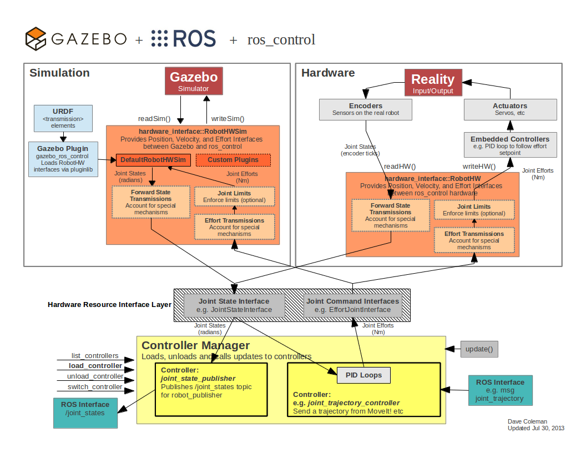

# ROS control
--------
# 教程：ROS控制

在本教程中，我们将设置模拟控制器来驱动机器人的关节。这将使我们能够为像[MoveIt!](http://moveit.ros.org/)这样的规划者提供正确的ROS接口。我们将使用[ros_control](http://ros.org/wiki/ros_control)包，这是ROS中控制器接口的一个新标准

#### 关于 `ros_control`

我们鼓励你在继续之前阅读关于`ros_control`的文档概述

#### `ros_control`与 Gazebo 的数据流

在Gazebo中模拟机器人的控制器可以使用`ros_control`和一个简单的Gazebo插件适配器来完成。仿真、硬件、控制器和传输之间的关系概述如下：



# 预备知识

本教程建立在之前教程中的许多概念基础上。我们将再次使用[Using URDF in Gazebo](http://gazebosim.org/tutorials/?tut=ros_urdf)中设置的RRBot，作为这里所涉及的插件的例子

# 用法

#### 在URDF中添加传输元素

为了在机器人上使用`ros_control`，你需要在URDF中添加一些额外的元素。`<transmission>`元素是用来连接执行器和关节的，具体的XML格式请看`<transmission>`[规范](http://ros.org/wiki/urdf/XML/Transmission)

就目前实现的`gazebo_ros_control`而言，这些传输标签中唯一重要的信息是：

- `<joint name="">` 名称必须与URDF中其他地方的关节相对应
- `<type>` 传输的类型，目前只实现了`transmission_interface/SimpleTransmission`(欢迎添加更多)
- `<hardwareInterface>` 在`<actuator>`和`<joint>`标签中，它告诉`gazebo_ros_control`插件要加载什么硬件接口（位置、速度或工作接口），目前只实现了工作接口(欢迎添加更多的接口)

其余的名称和元素目前都被忽略了

#### 添加 `gazebo_ros_control`插件

除了需要`transmission`，还需要在你的URDF中添加一个Gazebo插件，它可以实际解析`transmission`标签并加载相应的硬件接口和控制器管理器。默认情况下，`gazebo_ros_control`插件是非常简单的，不过它也可以通过额外的插件架构进行扩展，允许实力用户在`ros_control`和 Gazebo 之间创建自己的自定义机器人硬件接口。

默认的插件XML应该被放入到你的URDF文件中：

```xml
<gazebo>
  <plugin name="gazebo_ros_control" filename="libgazebo_ros_control.so">
    <robotNamespace>/MYROBOT</robotNamespace>
  </plugin>
</gazebo>
```

`gazebo_ros_control` <plugin>标签也有以下可选的子元素：

- `<robotNamespace>`: 该插件实例要使用的ROS命名空间，默认为URDF/SDF中的机器人名称
- `<controlPeriod>`: 控制器更新的周期（秒），默认为Gazebo的周期
- `<robotParam>`: 机器人描述（URDF）在参数服务器上的位置，默认为`/robot_description`
- `<robotSimType>`: 要使用的自定义机器人模拟界面的pluginlib名称，默认为`DefaultRobotHWSim`

##### 默认`gazebo_ros_control`行为方式

默认情况下，如果没有`<robotSimType>`标签，`gazebo_ros_control`将试图从URDF中获取与基于`ros_control`的控制器接口所需的所有信息。这对于大多数情况来说已经足够了，至少对于入门来说是好的

默认行为提供了以下`ros_control`接口

- `hardware_interface::JointStateInterface`
- `hardware_interface::EffortJointInterface`
- `hardware_interface::VelocityJointInterface` - not fully implemented

##### 进阶：自定义`gazebo_ros_control`仿真插件

`gazebo_ros_control`Gazebo插件还提供了一个`pluginlib-based`的接口，用于实现Gazebo和`ros_control`之间的自定义接口，以模拟更复杂的机制（非线性弹簧、连杆等）

这些插件必须继承`gazebo_ros_control::RobotHWSim`，它实现了一个模拟的`ros_control` `hardware_interface::RobotHW`。`RobotHWSim`在Gazebo模拟器中提供API级别的访问，以读取和命令关节属性

在URDF模型中指定各自的`RobotHWSim`子类，并在加载机器人模型时加载。例如，下面的XML将加载默认插件（与使用`<robotSimType>`标签时的行为相同）

```xml
<gazebo>
  <plugin name="gazebo_ros_control" filename="libgazebo_ros_control.so">
    <robotNamespace>/MYROBOT</robotNamespace>
    <robotSimType>gazebo_ros_control/DefaultRobotHWSim</robotSimType>
  </plugin>
</gazebo>
```

#### RRBot Example

我们为每个我们希望让Gazebo执行的关节添加一个类似于下面的`<transmission>`块。请注意，`<hardwareInterface>`必须同时包含在`<joint>`和`<actuator>`标签中（见这里的[ros_control问题](https://github.com/ros-controls/ros_control/issues/177)）。打开你的`rrbot.xacro`文件，在文件的底部你应该看到

```xml
  <transmission name="tran1">
    <type>transmission_interface/SimpleTransmission</type>
    <joint name="joint1">
      <hardwareInterface>EffortJointInterface</hardwareInterface>
    </joint>
    <actuator name="motor1">
      <hardwareInterface>EffortJointInterface</hardwareInterface>
      <mechanicalReduction>1</mechanicalReduction>
    </actuator>
  </transmission>

  <transmission name="tran2">
    <type>transmission_interface/SimpleTransmission</type>
    <joint name="joint2">
      <hardwareInterface>EffortJointInterface</hardwareInterface>
    </joint>
    <actuator name="motor2">
      <hardwareInterface>EffortJointInterface</hardwareInterface>
      <mechanicalReduction>1</mechanicalReduction>
    </actuator>
  </transmission>
```

你还会看到`rrbot.gazebo`中的`gazebo_ros_control`插件，它可以读取所有的`<transmission>`标签

```xml
<gazebo>
  <plugin name="gazebo_ros_control" filename="libgazebo_ros_control.so">
    <robotNamespace>/rrbot</robotNamespace>
  </plugin>
</gazebo>
```

#### 创建`ros_control`包

接下来我们需要为我们与Gazebo接口的`ros_control`控制器创建一个配置文件和启动文件

##### 创建新的包

```sh
mkdir ~/catkin_ws
cd ~/catkin_ws
catkin_create_pkg MYROBOT_control controller_manager joint_state_controller robot_state_publisher
cd MYROBOT_control
mkdir config
mkdir launch
```

[rrbot_control](https://github.com/ros-simulation/gazebo_ros_demos/tree/kinetic-devel/rrbot_control)

##### 创建`yaml`配置文件

PID增益和控制器设置必须保存在一个yaml文件，通过roslaunch文件加载到param服务器。在您的`MYROBOT\_control`软件包的`config`文件夹中，将以下RRBot例子改编为`MYROBOT_control/config/rrbot_control.yaml`

```yaml
rrbot:
  # Publish all joint states -----------------------------------
  joint_state_controller:
    type: joint_state_controller/JointStateController
    publish_rate: 50  

  # Position Controllers ---------------------------------------
  joint1_position_controller:
    type: effort_controllers/JointPositionController
    joint: joint1
    pid: {p: 100.0, i: 0.01, d: 10.0}
  joint2_position_controller:
    type: effort_controllers/JointPositionController
    joint: joint2
    pid: {p: 100.0, i: 0.01, d: 10.0}
```

有关这些控制器的详细信息，请参见下一节

##### 创建roslaunch

创建一个roslaunch文件用于启动`ros_control`控制器。在启动文件夹中创建一个`MYROBOT_control/launch/MYROBOT_control.launch`文件，并将下面的RRBot例子放到你的机器人上

```xml
<launch>

  <!-- Load joint controller configurations from YAML file to parameter server -->
  <rosparam file="$(find rrbot_control)/config/rrbot_control.yaml" command="load"/>

  <!-- load the controllers -->
  <node name="controller_spawner" pkg="controller_manager" type="spawner" respawn="false"
    output="screen" ns="/rrbot" args="joint1_position_controller joint2_position_controller joint_state_controller"/>

  <!-- convert joint states to TF transforms for rviz, etc -->
  <node name="robot_state_publisher" pkg="robot_state_publisher" type="robot_state_publisher"
    respawn="false" output="screen">
    <remap from="/joint_states" to="/rrbot/joint_states" />
  </node>

</launch>
```

**说明**

第一行 "rosparam "通过加载yaml配置文件（在下一节讨论）将控制器设置加载到参数服务器。

`controller_spawner`节点通过运行一个python脚本来启动RRBot的两个联合位置控制器，该脚本对`ros_control`控制器管理器进行服务调用。服务调用告诉控制器管理器你想要哪些控制器。它还加载了第三个控制器，该控制器用`hardware_interface`发布所有关节的关节状态，并`/joint_states`上发布广告主题。spawner只是一个与roslaunch一起使用的辅助脚本。

最后一行启动一个`robot_state_publisher`节点，它只是简单地监听来自`joint_state_controller`的`/joint_states`消息，然后将变换的信息发布到/tf。这允许你在Rviz中看到你的模拟机器人，以及做其他任务。

#### 使用roslaunch启动控制器


