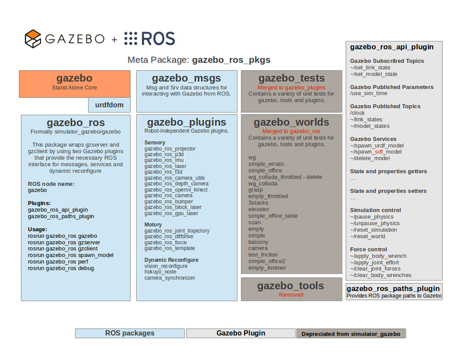

## ROS 概述
## 教程: ROS 综合概述

> 对于 ros2，[ROS2 综合概述](http://gazebosim.org/tutorials?tut=ros2_overview)

为了实现 ROS 与 Gazebo 的集成，名为 [gazebo_ros_pkgs](http://ros.org/wiki/gazebo_ros_pkgs) 的ROS包提供了 Gazebo 的封装器。它提供了必要的接口，以便在 Gazebo 中使用ROS 消息、服务和动态重新配置来模拟机器人的一些功能：

+ 没有与 ROS 绑定，独立的系统依赖
+ 使用 [catkin](http://www.ros.org/wiki/catkin) 构建
+ URDF 和 SDF 进行相同地处理
+ 减少代码重复
+ 改进对使用`ros_control`的控制器的开箱即用支持
+ 整合了 DARPA 机器人挑战赛中的实时控制器效率改进
+ 清理以前版本的 ROS 和 Gazebo 的旧代码

`gazebo_ros_pkgs`接口的概述见下图：



### 从`simulator_gazebo`升级

下面的指南将帮助你升级你的依赖 Gazebo 的包，从`simulator_gazebo`用于你的 ROS 包：

#### Launch Files

之前创建的roslaunch文件需要做一些修改才能启动Gazebo。更新这些包的最好方法是查看[Using roslaunch files to spawn models in Gazebo](./Using%20roslaunch.md)教程。简单点说：

+ 在roslaunch文件中，需要将`pkg="gazebo"`改名为`pkg="gazebo_ros"`
+ `gazebo_worlds`包已经被删除。大多数world文件很少被使用，并且没有随着SDF XML格式的变化而被维护。
因此，所有的world文件都被集中在 Gazebo 项目本身，包括`empty.world`
+ 使用 Gazebo 启动文件的最好方法是简单地继承位于`gazebo_ros`包中的`empty_world`启动文件

#### CMakeLists.txt

ROS封装的Gazebo版本已被移除，改为系统安装的Gazebo。这可能需要重新配置你的CMake文件。下面是一个CMakeLists.txt的例子：

```cmake
cmake_minimum_required(VERSION 2.8.3)
project(YOURROBOT_gazebo_plugins)

find_package(catkin REQUIRED COMPONENTS
  gazebo_ros
)

# Depend on system install of Gazebo
find_package(gazebo REQUIRED)

include_directories(include ${catkin_INCLUDE_DIRS} ${GAZEBO_INCLUDE_DIRS} ${SDFormat_INCLUDE_DIRS})

# Build whatever you need here
add_library(...) # TODO

catkin_package(
    DEPENDS
      gazebo_ros
    CATKIN_DEPENDS
    INCLUDE_DIRS
    LIBRARIES
)
```

#### package.xml

增加对新的 gazebo_ros包的依赖

```xml
<build_depend>gazebo_ros</build_depend>
<run_depend>gazebo_ros</run_depend>
```

#### Running Gazebo

启动 Gazebo 的 ROS 节点的名称已经改变，与 Gazebo 可执行文件的名称相一致：

+ `rosrun gazebo_ros gazebo` 启动 Gazebo server 和 GUI.
+ `rosrun gazebo_ros gzclient` 启动 Gazebo GUI.
+ `rosrun gazebo_ros gzserver` 启动 Gazebo server.

可供运行的节点：

```sh
rosrun gazebo_ros gazebo
rosrun gazebo_ros gzserver
rosrun gazebo_ros gzclient
rosrun gazebo_ros spawn_model
rosrun gazebo_ros perf
rosrun gazebo_ros debug
```

介绍这些节点更详细的文档在[Using roslaunch files to spawn models in Gazebo](./Using%20roslaunch.md)

继续阅读下一篇[Install gazebo_ros Packages](./Installing%20gazebo_ros_pkgs(ROS%201).md)

