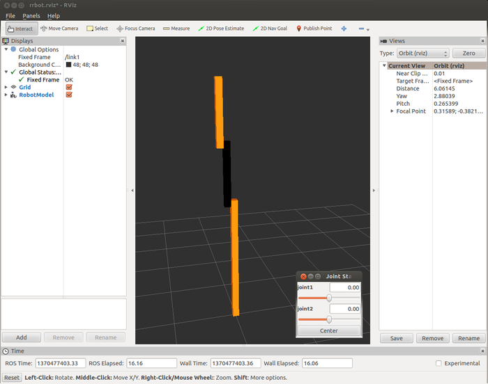
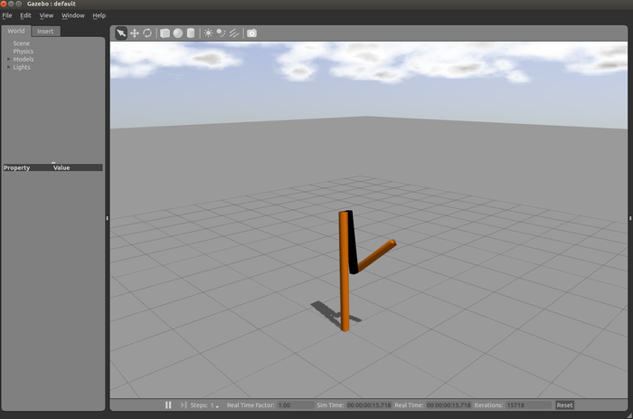

## URDF in Gazebo
## 教程：在Gazebo中使用URDF

[统一机器人描述格式](http://www.ros.org/wiki/urdf)（URDF）是ROS中用于描述机器人所有元素的XML文件格式。要在Gazebo中使用URDF文件，必须添加一些额外的仿真专用标签，以便与Gazebo正常工作。本教程解释了在Gazebo中成功使用基于URDF的机器人的必要步骤，使您不必从头开始创建一个单独的SDF文件和重复描述格式。最后，Gazebo将自动将URDF转换为SDF

#### 背景

虽然URDF在ROS中是一种有用的标准化格式，但它们缺乏许多功能，并且没有更新以应对机器人技术不断发展的需求。URDF只能孤立地指定单个机器人的运动学和动态特性。URDF不能指定机器人本身在一个世界中的姿态。它也不是一种通用的描述格式，因为它不能指定关节环路（平行连接），而且它缺乏摩擦和其他属性。此外，它不能指定不是机器人的东西，如灯光、高度图等

在实现方面，URDF语法打破了正确的格式，大量使用XML属性，这又使得URDF更加不灵活。同时也没有后向兼容的机制

为了解决这个问题，我们创建了一种名为[仿真描述格式](http://sdformat.org/)（SDF）的新格式，供Gazebo使用，以解决URDF的缺点。SDF是一个完整的描述，从世界级到机器人级的一切。它是可扩展的，并且可以轻松地添加和修改元素。SDF格式本身是用XML描述的，这就方便了一个简单的升级工具，将旧版本迁移到新版本。它也是自描述的

笔者的意图是让URDFs尽可能地在Gazebo中得到完整的记录和支持，但这与读者了解两种格式存在的原因和两者的缺点有关。如果能在URDFs上投入更多的工作，使其更新以适应当前机器人技术的需要，那就更好了

#### 概述

有几个步骤可以让URDF机器人在Gazebo中正常工作。以下是步骤的概述，然后在本教程的其余部分详细说明：

##### 必需

- 每个`<link>`元素中的`<inertia>`元素必须正确指定和配置

##### 可选

- 为每一个`<link>`添加`<gazebo>`元素
    + 将视觉颜色转换为Gazebo格式
    + 将stl文件转换为dae文件，以获得更好的纹理。
    + 添加传感器插件
- 为每一个`<joint>`添加`<gazebo>`元素
    + 设置适当的阻尼动态
    + 添加执行器控制插件
- 为`<robot>`元素添加`<gazebo>`元素
- 如果机器人需要刚性连接到`world/base_link`，则添加一个`<link name="world"/>`链接

#### `<gazebo>`元素

`<gazebo>`元素是对URDF的扩展，用于指定Gazebo中模拟目的所需的附加属性。它允许你指定在SDF格式中发现的、未包含在URDF格式中的属性。`<gazebo>`元素中的任何元素都不是必需的，因为默认值将被自动包含。有三种不同类型的`<gazebo>`元素--一种用于`<robot>`标签，一种用于`<link>`标签，一种用于`<joint>`标签。我们将在本教程中讨论每种类型的`<gazebo>`元素中的属性和元素

#### 必需

让你的机器人在Gazebo中工作的第一步是拥有一个来自相应[ROS URDF教程](http://www.ros.org/wiki/urdf/Tutorials)的工作URDF文件。在继续用Gazebo配置你的机器人之前，通过在[Rviz](http://www.ros.org/wiki/rviz)中查看URDF来测试你的URDF。在本教程中，我们将使用一个名为RRBot的简单演示机器人。欢迎跟随这个机器人或你自己的机器人一起学习

##### 获取 RRBot

RRBot，或 Revolute-Revolute Manipulator Robot，是一个简单的3连杆、2关节臂，我们将用它来演示Gazebo和URDF的各种功能。它本质上是一个双倒摆，并在模拟器中演示了一些有趣的控制概念

要获得RRBot，请将[gazebo_ros_demos Github repo](https://github.com/ros-simulation/gazebo_ros_demos.git)克隆到catkin工作区的`/src`文件夹中，然后重建你的工作区

```sh
cd ~/catkin_ws/src/
git clone https://github.com/ros-simulation/gazebo_ros_demos.git
cd ..
catkin_make
```

如果其中有不熟悉的地方，请务必阅读之前的[ROS概述教程](./ROS\ overview.md)。

##### 在 Rviz 中查看

要检查一切是否正常，在Rviz中启动RRBot

```sh
roslaunch rrbot_description rrbot_rviz.launch
```

你应该看到我们的小机器人是这样的：



如果你无法得到这个，请尝试用`killall roscore`杀死所有旧的 roscore 进程并重新启动 RViz

你也应该可以在Joint State Publisher窗口中玩滑杆来移动两个关节。

重要的是，在将你的机器人转换为在Gazebo中工作时，你不要破坏Rviz或其他ROS应用程序的功能，所以偶尔在Rviz中测试你的机器人以确保一切仍然有效是很好的

[gazebo_ros_control](http://gazebosim.org/tutorials?tut=ros_control)教程将解释如何使用Rviz通过直接从Gazebo发布`/joint_states`来监控你的模拟机器人的状态。在前面的例子中，Rviz中的RRBot是从一个假的`joint_states_publisher`节点（带有滑条的窗口）中获取其`/joint_states`

##### 检查 RRBot URDF

本教程的其余部分将参考RRBot URDF的各个方面。现在就去查看[rrbot.xacro file](https://github.com/ros-simulation/gazebo_ros_demos/blob/kinetic-devel/rrbot_description/urdf/rrbot.xacro)

```sh
rosed rrbot_description rrbot.xacro
```

请注意，我们使用[Xacro](http://ros.org/wiki/xacro)来使一些连接和关节的计算更容易。我们还包括两个附加文件

- [rrbot.gazebo](https://github.com/ros-simulation/gazebo_ros_demos/blob/kinetic-devel/rrbot_description/urdf/rrbot.gazebo) 一个Gazebo专用文件，它包含了大多数Gazebo专用的XML元素，包括标签
- [materials.xacro](https://github.com/ros-simulation/gazebo_ros_demos/blob/kinetic-devel/rrbot_description/urdf/materials.xacro) 一个简单的 Rviz 颜色文件，用于存储 rgba 值，并非真正必要

##### 在Gazeboz中观察

你也应该能够将RRBot放到到Gazebo

```sh
roslaunch rrbot_gazebo rrbot_world.launch
```

在启动的Gazebo窗口中，你应该看到机器人笔直地站着。尽管物理模拟器默认情况下没有故意干扰，但数值误差应该会开始积累，并在几秒钟后导致双倒摆下降。以下是RRBot的中摆截图



最终手臂应该完全停止。我们鼓励您在以下教程中调整和测试URDF的各个方面，以帮助您了解更多关于模拟URDF机器人的知识

#### URDF 文件的头部

在Gazebo和所需的URDF格式中有许多API变化，其中之一就是Gazebo的xml-schema命名空间不再需要了。如果你的URDF有这样的内容

```xml
<robot xmlns:sensor="http://playerstage.sourceforge.net/gazebo/xmlschema/#sensor"
       xmlns:controller="http://playerstage.sourceforge.net/gazebo/xmlschema/#controller"
       xmlns:interface="http://playerstage.sourceforge.net/gazebo/xmlschema/#interface"
       xmlns:xacro="http://playerstage.sourceforge.net/gazebo/xmlschema/#xacro"
       name="pr2" >
```

您可以删除它们。在您的根元素标签中，您所需要的只是机器人的名称，如果您使用xacro，还可以选择xml命名空间

```xml
<robot name="rrbot" xmlns:xacro="http://www.ros.org/wiki/xacro">
```

##### 标签的`<gazebo>`元素

如果使用`<gazebo>`元素时没有`reference=""`属性，则假设`<gazebo>`元素是针对整个机器人模型的。`<gazebo>`标签内的`<robot>`元素列在下表中：

|  Name  | Type |                                Description                                |
|:------:|:----:|:-------------------------------------------------------------------------:|
| static | bool | 如果设置为 "true"，则模型是不可移动的。否则，模型将在动力学引擎中进行模拟 |

`<gazebo>`标签内不在上表中的元素会直接插入到生成的SDF`<model>`标签中。这对于插件来说特别有用，正如[ROS Motor and Sensor Plugins](http://gazebosim.org/tutorials?tut=ros_gzplugins)中所讨论的那样。

#### 直接将模型固定在世界上

如果您想让您的URDF模型永久地连接到世界框架（地平面）上，您必须创建一个 world 链接和一个连接点，将其固定到您的模型底座上。RRBot通过以下方法来实现

```xml
  <!-- Used for fixing robot to Gazebo 'base_link' -->
  <link name="world"/>

  <joint name="fixed" type="fixed">
    <parent link="world"/>
    <child link="link1"/>
  </joint>
```

然而如果你有一个移动基地或其他一些移动的机器人，你不需要这个链接或关节

#### Links

确保你熟悉URDF[link](http://www.ros.org/wiki/urdf/XML/link)元素

下面是RRBot的一个例子链接

```xml
  <!-- Base Link -->
  <link name="link1">
    <collision>
      <origin xyz="0 0 ${height1/2}" rpy="0 0 0"/>
      <geometry>
        <box size="${width} ${width} ${height1}"/>
      </geometry>
    </collision>

    <visual>
      <origin xyz="0 0 ${height1/2}" rpy="0 0 0"/>
      <geometry>
        <box size="${width} ${width} ${height1}"/>
      </geometry>
      <material name="orange"/>
    </visual>

    <inertial>
      <origin xyz="0 0 1" rpy="0 0 0"/>
      <mass value="1"/>
      <inertia
        ixx="1.0" ixy="0.0" ixz="0.0"
        iyy="1.0" iyz="0.0"
        izz="1.0"/>
    </inertial>
  </link>
```

##### 单位须知

根据[ROS REP 103: Standard Units of measure and Coordinate Conventions](http://www.ros.org/reps/rep-0103.html)，Gazebo中的单位应该以米和公斤来指定。如果手动更改重力等常量，Gazebo可能会使用英制单位，但默认重力为9.81 m/s^2。当指定质量时，使用公斤单位

##### `<collision>`和`<visual>`元素

这些标签在Gazebo中和Rviz中的工作原理是一样的，但重要的是你必须同时指定这两个标签，因为与某些ROS应用不同，如果你没有明确指定`<collision>`元素，Gazebo将不会把你的`<visual>`元素作为`<collision>`元素。相反，Gazebo会将你的链接视为"invisible"

**简化碰撞模型**

你可以为你的碰撞和视觉元素使用相同的几何体或网格，不过为了提高性能，我们强烈建议你为你的碰撞几何体建立一个简化的模型/网格。Blender是一个很好的简化网格的开源工具。有许多闭源工具，如Maya和3DS Max，也可以简化网格

**材料：使用适当的颜色和质地**

标准的URDF可以使用标签指定颜色，比如在RRBot中

```xml
<material name="orange"/>
```

单独定义橙色，如在文件[materials.xacro](https://github.com/ros-simulation/gazebo_ros_demos/blob/master/rrbot_description/urdf/materials.xacro#L20-L22)中

```xml
  <material name="orange">
    <color rgba="${255/255} ${108/255} ${10/255} 1.0"/>
  </material>
```

不幸的是，这种指定链接颜色的方法在Gazebo中并不适用，因为它采用了OGRE的材质脚本对链接进行着色和纹理处理。取而代之的是，必须为每个链接指定一个Gazebo材质标签，比如：

```xml
  <gazebo reference="link1">
    <material>Gazebo/Orange</material>
  </gazebo>
```

如前所述，在RRBot的例子中，我们选择将所有Gazebo专用标签包含在一个名为[rbot.gazebo](https://github.com/ros-simulation/gazebo_ros_demos/blob/master/rrbot_description/urdf/rrbot.gazebo)的二级文件中。你可以在那里找到`<link>`和`<material>`元素

Gazebo中默认的可用材料可以在Gazebo源代码中找到，网址为[gazebo/media/materials/scripts/gazebo.material](https://github.com/osrf/gazebo/blob/master/media/materials/scripts/gazebo.material)

对于更高级或自定义的材料，你可以创建自己的OGRE颜色或纹理。请看：
- [The `<material>` SDF documentation](http://sdformat.org/spec?ver=1.5&elem=material)
- [OGRE materials documentation](http://www.ogre3d.org/tikiwiki/Materials)

**STL和Collada文件**

和Rviz一样，Gazebo可以使用[STL](http://en.wikipedia.org/wiki/STL_(file_format))和[Collada](http://en.wikipedia.org/wiki/Collada)文件。一般建议你使用Collada（.dae）文件，因为它们支持颜色和纹理，而使用STL文件，你只能有一个纯色

##### `<inertial>`元素

为了让Gazebo物理引擎正常工作，必须按照URDF链接元素页面上的记录提供`<inertial>`元素。为了不被Gazebo忽略，链接的质量必须大于零。此外，主惯性矩为零的链接(ixx, iyy, izz)在任何有限扭矩应用下都可能导致无限加速

为了在Gazebo中获得准确的物理近似，需要确定每个环节的正确值。这可以通过对机器人零件进行各种测量来实现，也可以通过使用CAD软件（如Solidworks）来实现，该软件包含了近似这些数值的功能。对于初学者来说，你也可以直接把这些值做出来

RRBot第一环节的惯性元件实例

```xml
    <inertial>
      <origin xyz="0 0 ${height1/2}" rpy="0 0 0"/>
      <mass value="1"/>
      <inertia
        ixx="1.0" ixy="0.0" ixz="0.0"
        iyy="1.0" iyz="0.0"
        izz="1.0"/>
    </inertial>
```

原点标签代表这个链接的质量中心。通过将质量中心设置为RRBot的矩形链接高度的一半，我们将质量中心设置在中间。你可以通过点击Gazebo的 View 菜单，选择 Wireframe 和 Center of Mass 来直观地检查你的URDF中的质量中心是否正确

在这个机器人的例子中，质量和惯性矩阵都是虚构的值，因为这个机器人没有现实世界的对应物

##### `<gazebo>`元素

单独解析的元素列表

<table border="1">
<tr>
<th>Name</th>
<th>Type</th>
<th>Description</th>
</tr>
<tr>
<td>material</td>
<td>value</td>
<td>视觉元素的材质</td>
</tr>
<tr>
<td>gravity</td>
<td>bool</td>
<td>使用重力</td>
</tr>
<tr>
<td>dampingFactor</td>
<td>double</td>
<td>链路速度的指数速度衰减--取值并将之前的链路速度乘以（1-阻尼系数）</td>
</tr>
<tr>
<td>maxVel</td>
<td>double</td>
<td>最大接触校正速度截断项</td>
</tr>
<tr>
<td>minDepth</td>
<td>double</td>
<td>应用接触校正脉冲前的最小允许深度</td>
</tr>
<tr>
<td>mu1</td>
<td rowspan="2">double</td>
<td rowspan="2"><a href="http://www.ode.org">Open Dynamics Engine (ODE)</a>定义的沿接触面的主要接触方向的摩擦系数μ(参见<a href="http://www.ode.org/ode-latest-userguide.html#sec_7_3_7">ODE's user guide</a>里的参数说明)
</td>
</tr>
<tr>
<td>mu2</td>
</tr>
<tr>
<td>fdir1</td>
<td>string</td>
<td>3-tuple指定mu1在碰撞局部参考框架中的方向</td>
</tr>
<tr>
<td>kp</td>
<td rowspan="2">double</td>
<td rowspan="2">
刚体接触的接触刚度k_p和阻尼k_d，由ODE定义
  (<a href="http://www.ode.org/ode-latest-userguide.html#sec_7_3_7">ODE uses erp and cfm</a>
  但是有一个
  <a href="https://github.com/osrf/gazebo/blob/gazebo9/gazebo/physics/ode/ODEJoint.cc">mapping between erp/cfm and stiffness/damping</a>)
</td>
</tr>
<tr>
<td>kd</td>
</tr>
<tr>
<td>selfCollide</td>
<td>bool</td>
<td>如果为真，该链接可以与模型中的其他链接发生碰撞</td>
</tr>
<tr>
<td>maxContacts</td>
<td>int</td>
<td>两个实体之间允许的最大接触数。该值覆盖物理学中定义的max_contacts元素</td>
</tr>
<tr>
<td>laserRetro</td>
<td>double</td>
<td>激光传感器返回的强度值</td>
</tr>
</table>

与`<robot>`的`<gazebo>`元素类似，任何未按上表解析的任意blobs都会被插入到SDF中相应的`<link>`元素中。这对插件特别有用，在[ROS Motor and Sensor Plugins](http://gazebosim.org/tutorials?tut=ros_gzplugins)中讨论过

##### RRBot元素的例子

在RRBot中，指定了两个非固定链接的摩擦系数，这样如果发生碰撞，就能模拟出更精确的接触互动。下面是一个链接的例子`<gazebo>`标签

```xml
  <gazebo reference="link2">
    <mu1>0.2</mu1>
    <mu2>0.2</mu2>
    <material>Gazebo/Black</material>
  </gazebo>
```

#### 关节

确保你熟悉[URDF joint documentation](http://www.ros.org/wiki/urdf/XML/joint)。然而，并非所有URDF接头的文档元素都适用于Gazebo

+ `<origin>`、`<parent>`、`child`是必需的
+ `<calibration>`和`<safety_controller>`可忽略
+ 在`<dynamics>`标签中，只有Gazebo4及以前的Gazebo使用了`damping`属性。Gazebo5及以上版本也使用`friction`属性
+ `<limit>`标签中的所有属性都是可选的

##### RRBot 例子

以下是RRBot中使用的关节

```xml
  <joint name="joint2" type="continuous">
    <parent link="link2"/>
    <child link="link3"/>
    <origin xyz="0 ${width} ${height2 - axel_offset*2}" rpy="0 0 0"/>
    <axis xyz="0 1 0"/>
    <dynamics damping="0.7"/>
  </joint>
```
请注意，动力学元件的粘性阻尼系数为0.7 N*m*s/rad，阻尼是简单的对任何关节速度（在这种情况下，单位角速度的扭矩）的反作用力，用于减缓一个运动的关节向静止方向移动

0.7 N*m*s/rad这个值是通过测试不同的阻尼量和观察摆动的钟摆出现的真实性来决定的。我们鼓励你现在就玩玩这个值（增加/减少），感受一下它对物理引擎的影响

##### Joints 里的 `<gazebo>`元素

<table border="1">
<tr>
<th>Name</th>
<th>Type</th>
<th>Description</th>
</tr>
<tr>
<td>stopCfm</td>
<td rowspan="2">double</td>
<td rowspan="2">Joint stop constraint force mixing (cfm) and error reduction parameter (erp) used by ODE</td>
</tr>
<tr>
<td>stopErp</td>
</tr>
<tr>
<td>provideFeedback</td>
<td>bool</td>
<td>Allows joints to publish their wrench data (force-torque) via a Gazebo plugin</td>
</tr>
<tr>
<td>implicitSpringDamper</td>
<td rowspan="2">bool</td>
<td rowspan="2">If this flag is set to true, ODE will use ERP and CFM to simulate damping.
This is a more stable numerical method for damping than the default damping tag.
The cfmDamping element is deprecated and should be changed to implicitSpringDamper.
</td>
</tr>

<tr>
<td>springStiffness</td>
<td rowspan="2">double</td>
<td rowspan="2">Spring stiffness in N/m.</td>
</tr>

<tr>
<td>springReference</td>
<td rowspan="2">double</td>
<td rowspan="2">Equilibrium position for the spring.
</td>
</tr>

<tr>
<td>cfmDamping</td>
</tr>
<tr>
<td>fudgeFactor</td>
<td>double</td>
<td>Scale the excess for in a joint motor at joint limits. Should be between zero and one.</td>
</tr>
</table>

同样，与`<robot>`和`<link>`的`<gazebo>`元素类似，任何未根据上表解析的任意blobs都会被插入到SDF中相应的`<joint>`元素中。这对插件特别有用，在[ROS Motor and Sensor Plugins](http://gazebosim.org/tutorials?tut=ros_gzplugins)中讨论过

#### 验证Gazebo模型是否有效

安装了Gazebo后，有一个简单的工具可以检查你的URDF是否可以正确地转换为SDF。只需运行以下命令

```sh
  # gazebo2 and below
  gzsdf print MODEL.urdf
  # gazebo3 and above
  gz sdf -p MODEL.urdf
```

这将向您显示从您输入的URDF中生成的SDF，以及任何关于生成SDF所需的缺失信息的警告

注意：在Gazebo 1.9和更高版本中，一些调试信息已经被移到了你可以查看的日志文件中

```sh
  cat ~/.gazebo/gzsdf.log
```

#### 在Gazebo中查看URDF

在Gazebo中查看RRBot在本教程的开头已经介绍过了。对于你自己的自定义机器人，我们假设它的URDF生活在子文件夹`/urdf`中的名为`MYROBOT_description`的ROS包中。使用ROS从该位置打开URDF到Gazebo的方法在之前的教程[Using roslaunch Files](./Using%20roslaunch.md)中已经介绍过。如果你还没有完成该教程，现在就去做

从该教程中，你应该有两个ROS包为你的自定义机器人。`MYROBOT_description`和`MYROBOT_gazebo`。要查看你的机器人并在Gazebo中测试它，你现在应该能够运行这样的东西

```sh
roslaunch MYROBOT_gazebo MYROBOT.launch
```

这将启动Gazebo服务器和GUI客户端，你的机器人将在里面自动启动生成

#### 调整您的模型

如果你的机器人模型在Gazebo中表现得出乎意料，很可能是因为你的URDF需要进一步调整，以准确地在Gazebo中表示其物理学。请参阅[SDF用户指南](http://gazebosim.org/sdf.html)，了解更多关于Gazebo中各种可用属性的信息，这些属性也可以通过`<gazebo>`标签在URDF中使用

#### 与世界分享您的机器人

如果你有一个普通的机器人，其他的机器人可能想在Gazebo中使用，我们鼓励你把你的URDF添加到[Gazebo模型数据库](http://gazebosim.org/tutorials?tut=model_structure&cat=build_robot)中。它是一个在线服务器，Gazebo连接到它，从互联网上拉下模型。它的Mercurial仓库位于[GitHub](https://github.com/osrf/gazebo_models)上。请参阅Gazebo模型数据库文档，了解如何提交拉取请求，将你的机器人添加到数据库中

#### 下一步

你现在已经学会了如何在Gazebo中使用包含URDF的ROS包，以及如何将你的自定义URDF转换到Gazebo中工作。您现在已经准备好学习向您的URDF添加插件，以便可以控制机器人的不同方面和模拟环境。请参阅[ROS电机和传感器插件](http://gazebosim.org/tutorials?tut=ros_gzplugins)

