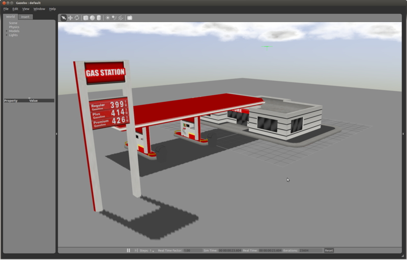
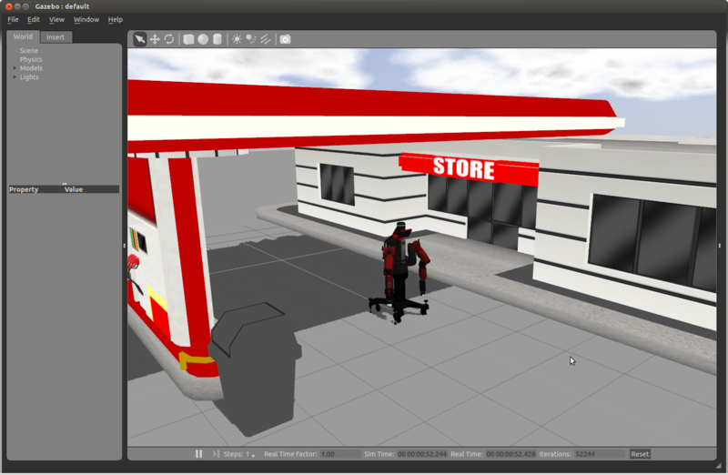
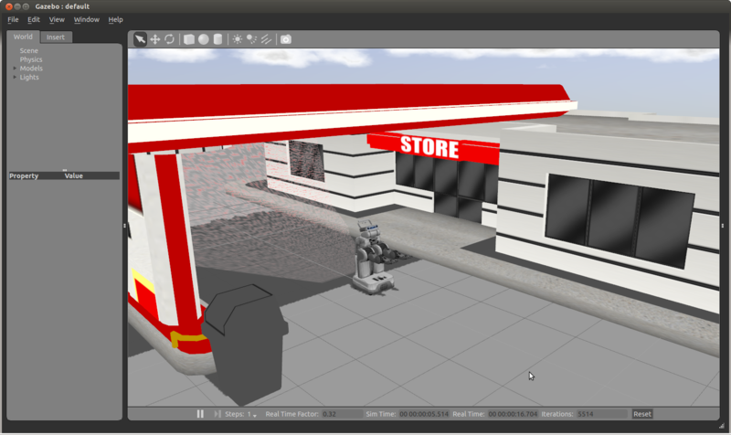

## 使用 roslaunch
## 教程：使用 roslaunch 启动 Gazebo，world 文件和 URDF 模型

有许多方法可以启动Gazebo，开放世界模型和产卵机器人模型到模拟环境中。
在本教程中，我们涵盖了ROS的做事方式：使用rosrun和roslaunch。
这包括将你的URDF文件存储在ROS包中，并将你的各种资源路径保持在ROS工作空间的相对位置。

#### 使用`roslaunch`打开 world 模型

roslaunch工具是启动ROS节点和带出ROS中机器人的标准方法。要启动一个空的Gazebo世界，类似于前面教程中的rosrun命令，只需运行：

```sh
roslaunch gazebo_ros empty_world.launch
```

##### `roslaunch`参数

你可以在 launch 文件后附加下面的参数来改变 Gazebo 的行为：

**paused**

>在暂停状态下启动Gazebo（默认为false）

**use_sim_time**

>告诉ROS节点要求获得Gazebo发布的模拟时间，通过ROS主题/clock发布（默认为true）

**gui**

>启动Gazebo的用户界面窗口（默认为true）

**headless**(已弃用)**recording**()

>开启 gazebo 状态日志记录

**debug**

>使用调试模式开启 Gazebo 服务端（默认为false）

**verbose**

>使用`--verbose`运行`gzserver`和`gzclient`，将错误和警告打印到终端（默认为false）

**server_required**

>当`gzserver`（Gazebo服务器）退出时终止启动脚本（默认为false）

**gui_required**

>当`gzclient`（用户界面窗口）退出时终止启动脚本（默认为false）

##### `roslaunch`命令示例

通常这些参数的默认值就是你所需要的，但只是作为一个例子：

```sh
roslaunch gazebo_ros empty_world.launch paused:=true use_sim_time:=false gui:=true throttled:=false recording:=false debug:=true verbose:=true gui_required:=true
```

##### 启动其它world demo

其它的world demo已经包含在`gazebo_ros`中，包括：

```sh
roslaunch gazebo_ros willowgarage_world.launch
roslaunch gazebo_ros mud_world.launch
roslaunch gazebo_ros shapes_world.launch
roslaunch gazebo_ros rubble_world.launch
```

注意在`mud_world.launch`中，启动了一个简单的联合机制。`mud_world.launch`的启动文件包含以下内容：

```xml
<launch>
  <!-- We resume the logic in empty_world.launch, changing only the name of the world to be launched -->
  <include file="$(find gazebo_ros)/launch/empty_world.launch">
    <arg name="world_name" value="worlds/mud.world"/> <!-- Note: the world_name is with respect to GAZEBO_RESOURCE_PATH environmental variable -->
    <arg name="paused" value="false"/>
    <arg name="use_sim_time" value="true"/>
    <arg name="gui" value="true"/>
    <arg name="recording" value="false"/>
    <arg name="debug" value="false"/>
  </include>
</launch>
```

在这个启动文件中，我们继承了`empty_world.launch`中的大部分必要功能，唯一需要修改的参数是`world_name`参数，用`mud.world`文件代替`empty.world`文件。s其他的参数都是简单的设置为默认值。

##### world 文件

继续检查`mud_world.launch`文件，我们现在来看`mud.world`文件的内容。mud world 的前几个组成部分如下：

```sh
<sdf version="1.4">
  <world name="default">
    <include>
      <uri>model://sun</uri>
    </include>
    <include>
      <uri>model://ground_plane</uri>
    </include>
    <include>
      <uri>model://double_pendulum_with_base</uri>
      <name>pendulum_thick_mud</name>
      <pose>-2.0 0 0 0 0 0</pose> 
   </include>
    ...
  </world>
</sdf>
```

**请看下面的部分，在您的电脑上查看这个完整的 world 文件**

在这个 wordld 文件片段中，你可以看到有三个模型被引用。这三个模型是在你的本地Gazebo模型数据库中搜索的。如果在那里没有找到，它们会自动从Gazebo的在线数据库中提取。

你可以在[Build A World](http://gazebosim.org/tutorials?cat=build_world)了解更多信息

**在电脑上查找 world 文件**

world 文件在你 Gazebo 资源路径的`/worlds`目录下。这个路径的位置取决于你安装 Gazebo 的方式和你所在的系统类型。要找到你的 Gazebo 资源的位置，使用以下命令：

```sh
env | grep GAZEBO_RESOURCE_PATH
```

路径可能是`/usr/local/share/gazebo-1.9`，在路径末尾添加`/worlds`，你应该有一个包含 Gazebo 使用的世界文件的目录，包括`mud.world`文件

#### 创建你自己的 Gazebo ROS 包

在继续介绍如何将机器人创建到 Gazebo 之前，我们先来了解一下使用 ROS 与 Gazebo 的文件层次标准，以便于我们进行后面的假设

现在，我们假设你的 catkin 工作区被命名为`catkin_ws`，尽管你可以将其命名为任何你想要的名字。总之，你的catkin工作区位于你的电脑上的某些位置，比如说：

```sh
/home/user/catkin_ws/src
```

根据ROS标准，所有关于你的机器人的模型和描述都位于一个名为`/MYROBOT_description`的包中，所有 world 文件和 Gazebo 使用的启动文件都位于一个名为`/MYROBOT_gazebo`的ROS包中。将'MYROBOT'替换为你的机器人的名字，用小写字母代替。有了这两个包，你的层次结构应该是这样的：

```sh
../catkin_ws/src
    /MYROBOT_description
        package.xml
        CMakeLists.txt
        /urdf
            MYROBOT.urdf
        /meshes
            mesh1.dae
            mesh2.dae
            ...
        /materials
        /cad
    /MYROBOT_gazebo
        /launch
            MYROBOT.launch
        /worlds
            MYROBOT.world
        /models
            world_object1.dae
            world_object2.stl
            world_object3.urdf
        /materials
        /plugins
```

请记住，`catkin_create_pkg`命令是用来创建新的包的，不过如果你需要的话，这个命令也可以很容易地适用于`rosbuild`。大多数这些文件夹和文件应该是不言而喻的。

下一节将指导你如何在自定义世界文件中使用这些设置

##### 创建一个自定义的 world 文件

你可以在自己的ROS包内创建自定义的`.world`文件，这些文件是针对你的机器人和包的。在这个迷你教程中，我们将制作一个有地面、太阳和加油站的空世界。以下是我们推荐的约定。确保用你的机器人的名字来代替`MYROBOT`，如果你没有机器人来测试，就用`test`来代替

+ 创建一个名为`MYROBOT_gazebo`的包
+ 在这个包中，创建一个`launch`文件夹
+ 在`launch`文件夹内创建一个`YOUROBOT.launch`文件，内容如下：

```xml
<launch>
  <!-- We resume the logic in empty_world.launch, changing only the name of the world to be launched -->
  <include file="$(find gazebo_ros)/launch/empty_world.launch">
    <arg name="world_name" value="$(find MYROBOT_gazebo)/worlds/MYROBOT.world"/>
    <!-- more default parameters can be changed here -->
  </include>
</launch>
```

+ 在同一软件包中，创建一个`world`文件夹，并创建一个`MYROBOT.world`文件，内容如下

```xml
<?xml version="1.0" ?>
<sdf version="1.4">
  <world name="default">
    <include>
      <uri>model://ground_plane</uri>
    </include>
    <include>
      <uri>model://sun</uri>
    </include>
    <include>
      <uri>model://gas_station</uri>
      <name>gas_station</name>
      <pose>-2.0 7.0 0 0 0 0</pose>
    </include>
  </world>
</sdf>
```

+ 现在你应该可以使用下面的命令启动你的自定义世界

```sh
. ~/catkin_ws/devel/setup.bash
roslaunch MYROBOT_gazebo MYROBOT.launch
```

你应该看到以下世界模型（用鼠标滚轮放大）：



##### 在 Gazebo 中编辑 World 文件

您可以在您的机器人世界文件中插入额外的模型，并使用`File->Save As`命令将您编辑的世界导出到您的ROS包中

#### 使用`roslaunch`生成 URDF 机器人

有两种方法可以使用`roslaunch`将URDF格式的机器人放到 Gazebo 中

**ROS服务调用生成方法**

>第一种方法可以让你的机器人的ROS包在计算机和仓库签出之间更易携带。它允许你保持你的机器人的位置相对于ROS包的路径，但也需要你使用一个小的（python）脚本进行ROS服务调用。

**模型数据库方法** 

>第二种方法允许你在.world文件中包含你的机器人，这看起来更干净、更方便，但需要你通过设置一个环境变量将你的机器人添加到Gazebo模型数据库中。

我们将介绍这两种方法。总的来说，我们推荐的方法是使用**ROS服务调用生成方法**

##### ROS服务调用生成方法

这个方法使用一个名为`spawn_model`的 python 脚本向`gazebo_ros`ROS节点（在`rostopic`命名空间中被简单地命名为" gazebo"）发出服务调用请求，将一个自定义的 URDF 添加到 Gazebo 中。`spawn_model`脚本位于 `gazebo_ros`包中。你可以用以下方式使用这个脚本：

```sh
rosrun gazebo_ros spawn_model -file `rospack find MYROBOT_description`/urdf/MYROBOT.urdf -urdf -x 0 -y 0 -z 1 -model MYROBOT
```

要查看`spawn_model`的所有可用参数，包括命名空间、`trimesh`属性、关节位置和`RPY`方向，请运行：

```sh
rosrun gazebo_ros spawn_model -h
```

**URDF 例子使用 Baxter**

如果你还没有URDF来测试，作为例子，你可以从[baxter_common](https://github.com/RethinkRobotics/baxter_common)下载`baxter_description`包。把这个包放到你的catkin工作区，运行：

```sh
git clone https://github.com/RethinkRobotics/baxter_common.git
```

现在您应该有一个名为`baxter.urdf`的 URDF 文件，位于`baxter_description/urdf/`内，您可以运行：

```sh
rosrun gazebo_ros spawn_model -file `rospack find baxter_description`/urdf/baxter.urdf -urdf -z 1 -model baxter
```

然后你应该看到类似下图界面：



要将其直接整合到ROS启动文件中，重新打开文件`MYROBOT_gazebo/launch/YOUROBOT.launch`，并在`</launch>`标签前添加以下内容：

```xml
<!-- Spawn a robot into Gazebo -->
<node name="spawn_urdf" pkg="gazebo_ros" type="spawn_model" args="-file $(find baxter_description)/urdf/baxter.urdf -urdf -z 1 -model baxter" />
```

启动这个文件，你应该会看到和使用rosrun时一样的结果

**XACRO 例子使用 PR2**

如果您的URDF不是XML格式，而是[XACRO](http://ros.org/wiki/xacro)格式，您可以对您的启动文件进行类似的修改。你可以通过安装这个软件包来运行这个PR2的例子：

**ROS Jade**

```sh
sudo apt-get install ros-jade-pr2-common
```

然后将其添加到本教程之前创建的启动文件中

```xml
<!-- Convert an xacro and put on parameter server -->
<param name="robot_description" command="$(find xacro)/xacro.py $(find pr2_description)/robots/pr2.urdf.xacro" />

<!-- Spawn a robot into Gazebo -->
<node name="spawn_urdf" pkg="gazebo_ros" type="spawn_model" args="-param robot_description -urdf -model pr2" />
```

启动这个文件，你应该可以看到加油站，如图所示：



注意：在写这篇文章的时候，由于Gazebo API的变化，PR2的URDF还有很多控制台输出的错误和警告需要修复

##### 模型数据库方法

第二种将机器人输出到 Gazebo 中的方法允许你在`.world`文件中包含你的机器人，这看起来更干净方便，但也需要你通过设置一个环境变量将你的机器人添加到 Gazebo 模型数据库中。
之所以需要这个环境变量，是因为 ROS 的依赖性与 Gazebo 分离，URDF 包路径不能直接在`.world`文件里面使用，因为 Gazebo 没有 ROS 包的概念

要完成这个方法，你必须制作一个新的模型数据库，其中只包含你的单个机器人。
这并不是将你的URDF加载到Gazebo中的最干净的方法，但可以实现不用在电脑上保留两个机器人URDF副本的目标。
如果下面的说明令人困惑，请参考[Gazebo Model Database](http://gazebosim.org/user_guide/started__models__database.html)文档来理解为什么需要这些步骤

我们假设你的ROS工作空间文件的层次结构已经设置好了，就像上面的章节所描述的那样。
唯一不同的是，现在一个`model.config`文件被添加到你的`MYROBOT_description`包中，就像这样。

```sh
../catkin_ws/src
    /MYROBOT_description
        package.xml
        CMakeLists.txt
        model.config
        /urdf
            MYROBOT.urdf
        /meshes
            mesh1.dae
            mesh2.dae
            ...
        /materials
        /plugins
        /cad
```

这个层次结构通过以下文件结构被调整为Gazebo模型数据库：

+ **`/home/user/catkin_workspace/src`** - Gazebo 模型数据库的位置
+ **`/MYROBOT_description`** - 该目录被视为一个单一的 Gazebo 模型文件夹
+ **`model.config`** - Gazebo 在其数据库中找到这个模型所需的配置文件
+ **`MYROBOT.urdf`** - 机器人描述文件，也被Rviz、MoveIt!等使用
+ **`/meshes`** - 把`.stl`或`.dae`文件放在这里，就像使用普通的URDF一样

**model.config**

每个模型都必须在模型的根目录下有一个包含模型元信息的`model.config`文件。基本上将其复制到`model.config`文件中，用你的文件名替换`MYROBOT.urdf`：

```xml
<?xml version="1.0"?>
<model>
  <name>MYROBOT</name>
  <version>1.0</version>
  <sdf>urdf/MYROBOT.urdf</sdf>
  <author>
    <name>My name</name>
    <email>name@email.address</email>
  </author>
  <description>
    A description of the model
  </description>
</model>
```

与SDFs不同，URDFs使用的标签不需要版本。更多信息请参见[Gazebo Model Database](http://gazebosim.org/user_guide/started__models__database.html)文档

**Environment Variable**

最后，你需要在你的`.bashrc`文件中添加一个环境变量，告诉 Gazebo 在哪里寻找模型数据库。使用你选择的编辑器编辑`~/.bashrc`。检查你是否已经定义了`GAZEBO_MODEL_PATH`。如果您已经有一个，请用分号附加到它，否则添加新的导出。假设你的 Catkin 工作区在`~/catkin_ws/`你的路径应该是这样的：

```sh
export GAZEBO_MODEL_PATH=/home/user/catkin_ws/src/
```

**Viewing in Gazebo - Manually**

现在通过启动Gazebo来测试你的新Gazebo模型数据库是否正确配置

```sh
gazebo
```

并点击左边的`Insert`标签。你可能会看到几个不同的下拉列表，这些列表代表了你系统中不同的模型数据库，包括在线数据库。找到与你的机器人相对应的数据库，打开子菜单，点击你的机器人名称，然后在 Gazebo 内选择一个位置放置机器人

**View In Gazebo - `roslaunch` with the Model Database**

模型数据库方法的优点是，现在你可以直接在你的世界文件中包含你的机器人，而不需要使用ROS包路径。我们将使用`Creating a world file`一节中的相同设置，但需要修改 world 文件：

+ 在同一个`MYROBOT_description/launch`文件夹内，编辑`MYROBOT.world`文件，内容如下：

```xml
<?xml version="1.0" ?>
<sdf version="1.4">
  <world name="default">
    <include>
      <uri>model://ground_plane</uri>
    </include>
    <include>
      <uri>model://sun</uri>
    </include>
    <include>
      <uri>model://gas_station</uri>
      <name>gas_station</name>
      <pose>-2.0 7.0 0 0 0 0</pose>
    </include>
    <include>
      <uri>model://MYROBOT_description</uri>
    </include>
  </world>
</sdf>
```

现在你应该可以使用下面的命令将你的 world 文件中的加油站和机器人放到Gazebo中

```sh
roslaunch MYROBOT_gazebo MYROBOT.launch
```

这种方法的缺点是，你打包的`MYROBOT_description`和`MYROBOT_gazebo`不容易在电脑之间移植--你首先要在任何新系统上设置`GAZEBO_MODEL_PATH`，才能使用这些ROS包

#### 从 package.xml 中导出模型路径

有用的信息将是从package.xml导出模型路径的格式

```xml
<run_depend>gazebo_ros</run_depend>
<export>
  <gazebo_ros gazebo_model_path="${prefix}/models"/>
  <gazebo_ros gazebo_media_path="${prefix}/models"/>
</export>
```

`${prefix}`是新用户可能也不会马上知道的东西，这里很有必要。

如果有一些关于如何从ROS端调试这些路径的信息也会很有用，例如，你可以使用` rospack plugins --attrib="gazebo_media_path" gazebo_ros`来检查将被 gazebo接收的媒体路径

#### 下一步

现在你已经知道如何创建打开Gazebo、world 文件和URDF模型的`roslaunch`文件了，在[Using A URDF in Gazebo](./URDF%20in%20Gazebo.md)创建你自己的 Gazebo-ready URDF 模型

